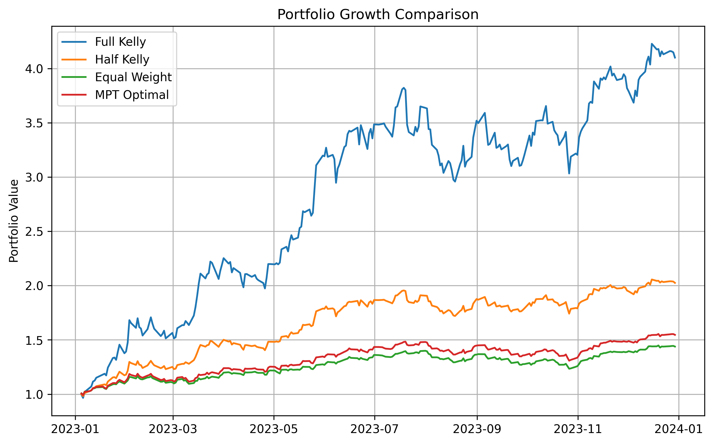
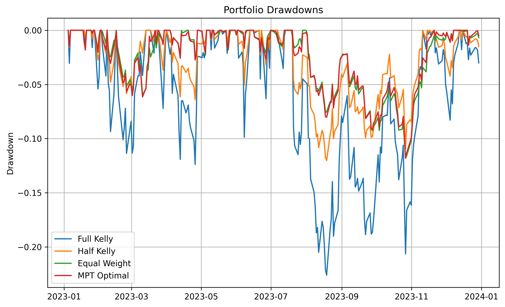

# Kelly Criterion Portfolio Optimization

A quantitative finance project analyzing long-term portfolio growth using the Kelly Criterion, compared to Mean-Variance Optimization and other portfolio strategies.

## Strategies Compared
- Full Kelly
- Half Kelly (0.5x leverage)
- Equal-Weight Portfolio
- Mean-Variance Optimal (Sharpe-Maximizing)

## Key Insights
- Full Kelly delivers the highest growth but suffers the largest drawdowns (~−22%)
- Half Kelly achieves a similarly high Sharpe ratio (~2.92) with significantly reduced drawdowns
- Mean-Variance Optimization is more conservative and stable, balancing return and volatility
- Equal-weighting performs surprisingly well, reinforcing the robustness of naive diversification under noisy parameter estimation

## Charts

*Portfolio value over time under different allocation strategies*

*Percentage drawdown from peak portfolio value*

## Repository Structure
- `KellyPortfolioOptimization.ipynb` — Complete analysis and visualizations
- `data/StockData.csv` — Source data (daily adjusted close prices for SPY, QQQ, AAPL)
- `images/` — Generated charts used in analysis

## Demonstrated Concepts
- Log-return and covariance estimation
- Kelly Criterion weight calculation
- Fractional Kelly as a risk-adjusted alternative
- Mean-Variance Optimization using numerical optimization
- Rolling Sharpe ratios, drawdown analysis, and out-of-sample testing
